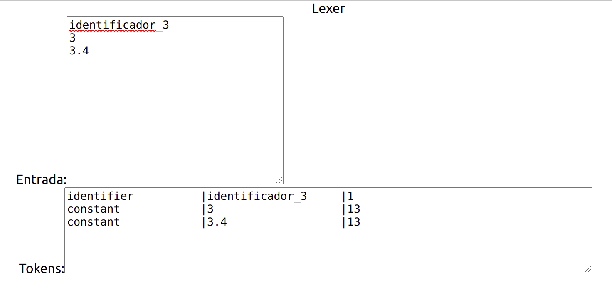

## Analizador léxíico

Este programa puede reconocer los tokens de un programa tipo C y está pensado para ser la primera etapa del análisis del lenguaje en un compilador
Esta implementado mediante expresiones regulares en contraste con un autómata tradicional, cada lexema tiene un patrón correspondiente que se expresa mediante una expresión regular. El texto de entrada es analizado para buscar los tokens mediante los patrones de búsqueda.

