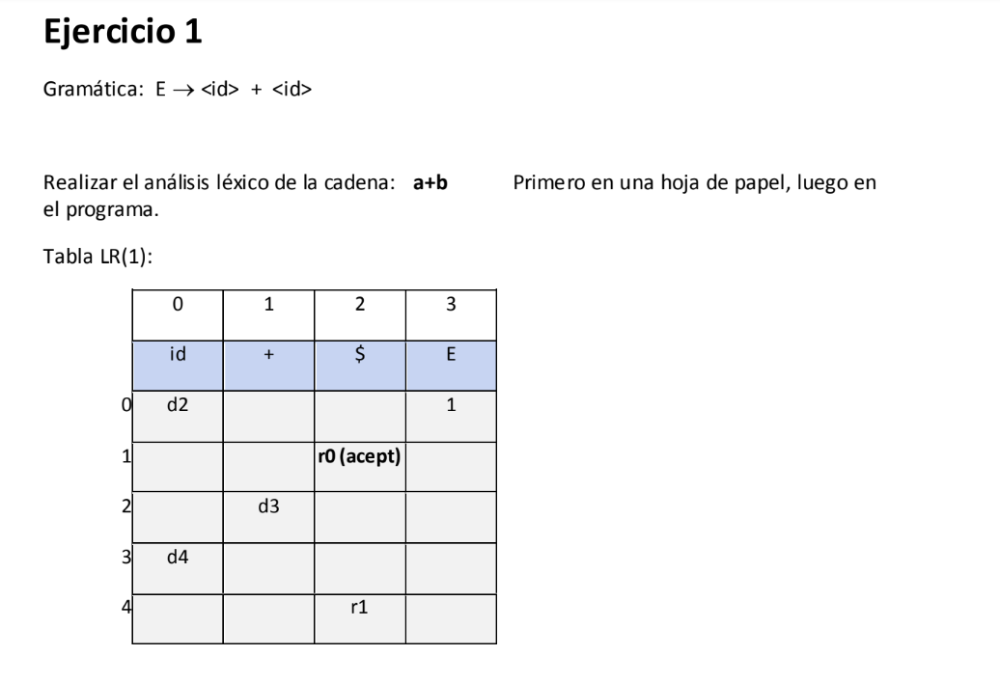
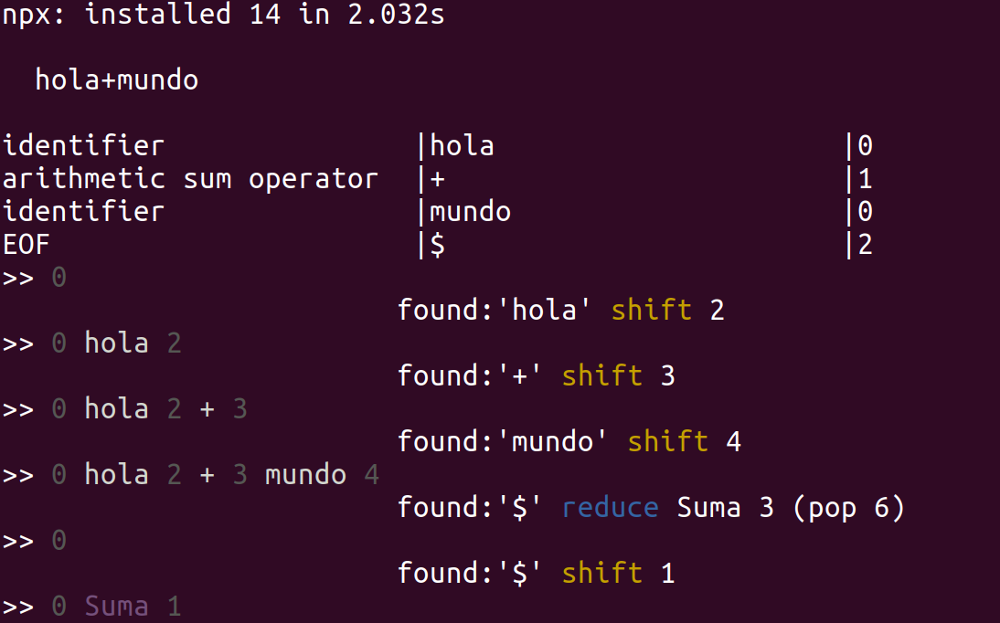

##  Analizador sintáctico miniatura

Se presentan dos ejemplos sencillos de gramáticas para realizar el análisis sintáctico. Para esto, el analizador se desarrolló tomando en cuante que debe funcionar para más de una sintaxis.


Esta es la siguiente etapa del parseador/compilador para un lenguaje básico tipo C. Partiendo de la etapa anterior, el analizador sintáctico implementa el algoritmo de un parseador SLR para una gramática predefinida.

El analizador simplemente retorna null o true, es decir, si la sintaxis es inválida o es válida respectivamente.

Para demostrar el funcionamiento del analizador, se desarrolló de tal manera que se pudiera visualizar la pila del mismo y ver qué ocurre dentro.

En la captura, cada dos líneas representan: la pila del analizador (resaltada con el símbolo ">>")y el símbolo actual junto con la acción a realizar.
La acción se representa como shift (amarillo) o reduce (azul)
En la pila se colorean de púrpura las expresiones reducidas, de blanco los tokens y de gris los estados.

### Ejemplo 1

```
[ENTRADA VÁLIDA:]
    hola+mundo
```



### Ejemplo 2

```
[ENTRADA VÁLIDA:]
    a+b+c+d+e+f
    
```


#### Analizador léxico

Este programa puede reconocer los tokens de un programa tipo C y está pensado para ser la primera etapa del análisis del lenguaje en un compilador
Esta implementado mediante expresiones regulares en contraste con un autómata tradicional, cada lexema tiene un patrón correspondiente que se expresa mediante una expresión regular. El texto de entrada es analizado para buscar los tokens mediante los patrones de búsqueda.


